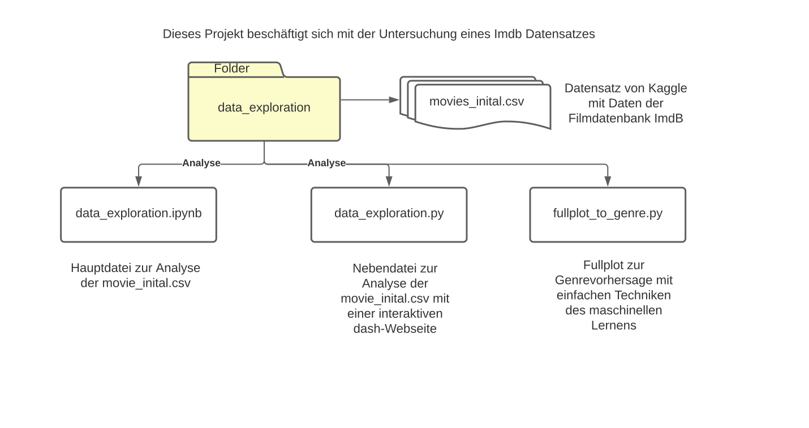
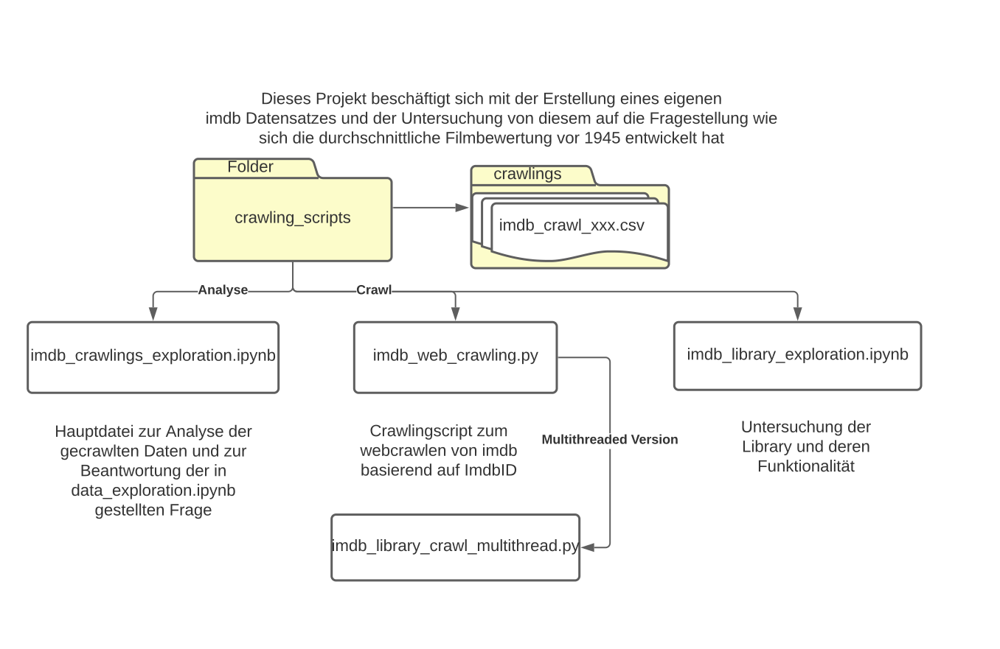

### Datenuntersuchung von IMDb-Datensatz, Erstellung eines eigenen Datensatzes und eine Stimmungsanalyse

Folgend wird der Aufbau der Projektstruktur erläutert.

## Untersuchung eines ImdB Datensatzes

Im Ordner data_exploration ist unter anderem Der Datensatz von Kaggle zu finden, außerdem das Notebook zur Hauptanalyse des Datensatzes 
und zusätzlich das Python Skript data_exploration.py

Mit diesem Python Skript kann eine interaktive dash Webseite gestartet werden. Dafür müssen folgende Befehle ausgeführt werden:
- python data_exploration.py (wenn man bereits im Ordner data_exploration ist)
- im Browser 127.0.0.1:8050 aufrufen
- viel Spaß auf der interaktiven Webseite

## Erstellung eines eigenen Datensatzes

In dem Ordner crawling_scripts gibt es hauptsächlich zwei Komponenten:
- Crawling Teil
- Analyse Teil

Im Crawling Teil gibt es ein Notebook, mit dem die Funktonalitäten der benutzten Bibliothek untersucht wurden. Außerdem gibt es zwei Skripte imdb_web_crawling.py und imdb_library_crawl_multithread.py die zum Crawlen der Daten verwendet wurden. Hauptsächlich wurde die multithreaded Version genutzt. Von dem Crawling Skript werden Dateien im Ordner crawlings abgespeichet, die im Analyse Teil verwendet werden.

Für den Analyse Teil dient das Notebook imdb_crawlings_exploration.ipynb. Mit diesem wird die Fragestellung der Entwicklung der durchscnittlichen Filmbewertung vor 1945 bearbeitet.

## Stimmungsanalyse

Im dritten Ordner wird auf Basis der IMDb-Bewertungen eine Stimmungsanalyse durchgeführt.
Der Hauptteil ist ebenfalls in zwei Teile unterteilt:
- Preprocessing
- Training und Evaluation

Im Notebook sentiment_analysis_preprocessing.ipynb werden die Daten für die eigentliche Stimmungsanalyse vorbereitet.
Im Teil Training und Evaluation werden verschiedene Transformer und Techniken verwendet. Hier gibt es mehrere Notebooks, die in unten stehendem Bild aufgelistet sind.

Die angelernten Modelle sind im Ordner models abgelegt. Im Ordner preprocessed sind die vorverarbeiteten Daten bereits in train, validate und test split abgelegt. Diese sind der Output des Preprocessing-Notebooks.

